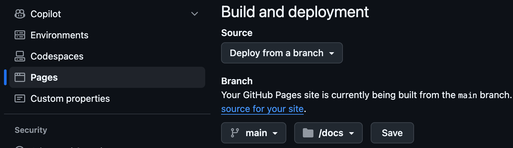

# Pimp Up Your Documentation with GitHub Pages

## Making Your Repository Docs Accessible


---

## Previously - Pimp Up Your Documentation with Docusaurus, February

### 1. Docusaurus (Feature-Rich)

### 2. GitHub Pages (Fast & Simple)

Let's compare.


---

## The Problem

Your documentation lives in markdown files scattered across your repo.

- ❌ Hard to navigate
- ❌ No visual hierarchy
- ❌ Difficult for non-developers to find information

**Solution:** Turn your markdown into beautiful HTML sites.

---

## Why make your docs an HTML site?

### 👥 **Accessibility**

Developers, Product Owners, and Agile Coaches can access documentation without cloning the repo or navigating GitHub.

### 📋 **Traceability**

Track decisions, outcomes, and architectural choices in one central, searchable location.

### 🎯 **Clarity**

Visual hierarchy and navigation make complex information digestible.

### 📊 **Professionalism**

Shows discipline in knowledge management and organizational maturity.

---

## GitHub Pages: The Easy Route

### Setup

1. Enable GitHub Pages in repository settings
2. Create `index.md` files in directories
3. Add Jekyll configuration (recommended)
4. Push to GitHub

**Time investment:** 1 hour ⚡

---

## Example: GitHub Pages Structure

```
docs/
├── index.md                # Homepage
├── _config.yml             # Jekyll configuration
├── architecture/
│   ├── index.md            # Architecture overview
│   ├── decisions.md
│   └── patterns.md
├── api/
│   ├── index.md            # API documentation
│   └── endpoints.md
└── guides/
    ├── index.md            # Getting started
    └── setup.md
```

Each `index.md` links to other pages.

---

## GitHub Pages: The Trade-offs

### ✅ Advantages

- **No project overhead** - Use existing markdown files
- **Quick setup** - Just enable a switch
- **Minimal configuration** - Additional index.md files and Jekyll config
- **Works immediately** - No build process knowledge needed

### ❌ Disadvantages

- **Manual navigation** - Create index.md files per directory
- **No auto-generated sidebar** - You write the links
- **Limited features** - Basic styling only
- **Feedback delay** - Can't preview locally easily

---

## Docusaurus: The Feature Route

### Setup

1. Create Docusaurus project
2. Configure structure (2 hours)
3. Run locally to preview
4. Deploy via GitHub Action

**Time investment:** 2-4 hours 🔧

---

## Docusaurus - ✅ Built-in Features

- **Auto-generated sidebar** - File tree navigation
- **Top navigation bar** - Custom sections
- **Blog feature** - Perfect for meeting notes
- **Search functionality** - Find anything instantly
- **Link validation** - Catch broken doc links at compile time
- **Local preview** - See changes immediately
- **Versioning** - Document multiple versions


---

## Docusaurus - ❌ Trade-offs

- **React project in your repo** - Extra files to maintain
- **Learning curve** - Configuration and setup
- **Build complexity** - Requires Node.js knowledge
- **Initial time investment** - 1-2 hours setup


---

## Our Context: Tech Stack

**ART Stack:**

- ✅ TypeScript experienced
- ✅ React familiar
- ✅ Build tools known

**Implication:** Docusaurus setup is NOT difficult for us.

---

## Comparison Table

| Feature                | GitHub Pages  | Docusaurus  |
| ---------------------- | ------------- | ----------- |
| **Setup time**         | 1 hour        | 2-4 hours   |
| **Local preview**      | Limited       | ✅ Full     |
| **Sidebar navigation** | Manual        | ✅ Auto     |
| **Blog feature**       | ❌ No         | ✅ Yes      |
| **Search**             | ❌ No         | ✅ Yes      |
| **Link validation**    | ❌ No         | ✅ Yes      |
| **Configuration**      | ✅ Minimal    | 🟡 Moderate |
| **React knowledge**    | ❌ Not needed | ✅ Helpful  |

---

## Decision Framework

### Choose GitHub Pages if

- ✅ Documentation is simple and minimal
- ✅ You want fast results: Is it worth having documentation as HTML?x
- ✅ Navigation structure is flat
- ✅ Team is not tech-savvy

### Choose Docusaurus if

- ✅ Documentation is extensive
- ✅ You want more helpful features (search, blog, better overview out-of-the-box)
- ✅ You want local preview capability
- ✅ Team is comfortable with React/TypeScript

---

## The Bottom Line

- 🚀 **GitHub Pages:** Fast iteration, minimal overhead
- 🎨 **Docusaurus:** Professional output, feature-rich

Either way: **Your documentation becomes discoverable and maintainable.**

---

## Next Steps - Try GitHub Pages

1. Create a `docs/` folder
2. Add `index.md` files
3. Enable GitHub Pages in settings
4. Share the URL with your team



---

## Next steps - Try Docusaurus

1. `npx create-docusaurus@latest my-docs classic`
2. Configure site info
3. Run `npm run start`
4. Deploy via GitHub Action

**Start today. Both are quick.**

---

## Questions? 😲

## I gotta go! 💨


